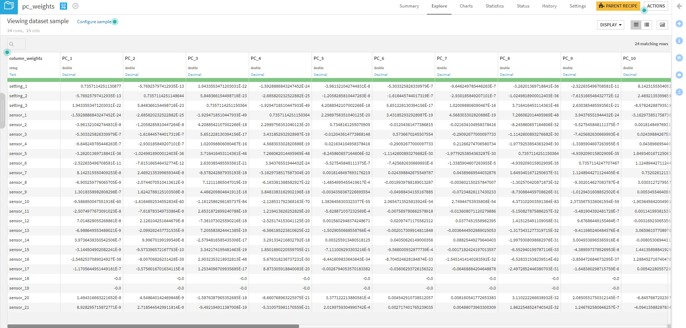

# Instructions
- This recipes is used to reduce the dimenison of the input dataset by the PCA (Principal Component Analysis), refered [sklearn.pca](https://scikit-learn.org/stable/modules/generated/sklearn.decomposition.PCA.html) then displayed on DSS DataIku.
- Icon of this plugin on DSS, choose your dataset then find

after set the name of the output datasets, you will have

# Input parameters
- Look at the image below,

 
- Here, I set the `input_params` :
>- `explained_ratio to keep`: the percentage of the original dataset that be kept in the reduced data. 
>- `columns to keep` : when transformed the PCA, we must ignore/ drop the specified columns as `datetime, id, etc`, we must apply PCA on the numeric dataset. Hence, after applying the PCA, we will add the "ignored columns" into the new dataset alias the `pca_dataset`.
>- The `random_state` and `svd_solver` has been explained in this [documen](https://scikit-learn.org/stable/modules/generated/sklearn.decomposition.PCA.html)
 
# Outputs
## The pca_dataset
This is the dataset after you implement the PCA algorithm 

  
  
## The PC_weights
This is the weights of each PC, you can recover the original dataset or verify the `pca_dataset` by the multiplication with the `weight_matrix` or its inverse matrix.

  
