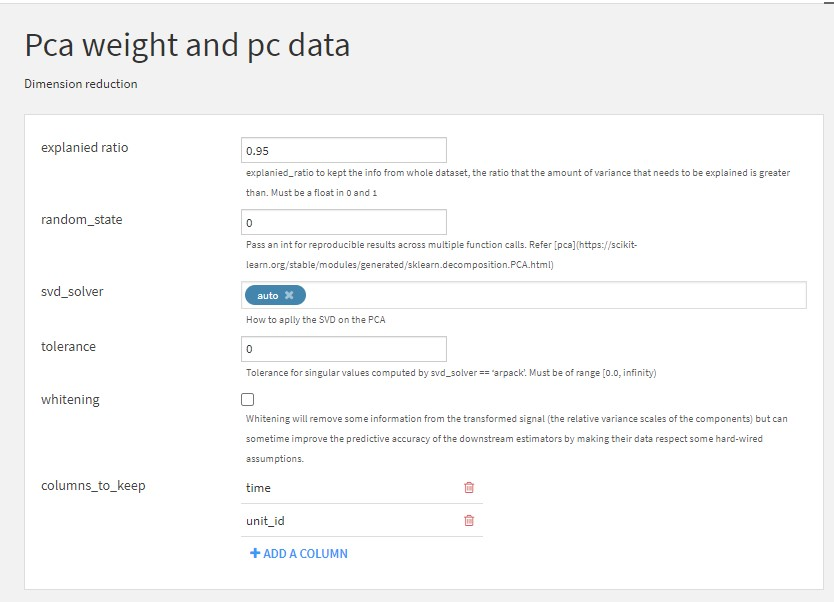

# Instructions
- This recipes is used to reduce the dimenison of the input dataset by the PCA (Principal Component Analysis), refered [sklearn.pca](https://scikit-learn.org/stable/modules/generated/sklearn.decomposition.PCA.html) then displayed on DSS DataIku.
- Icon of this plugin on DSS, choose your dataset then find

after set the name of the output datasets, you will have

# Input parameters

 
# Outputs
## The pca_dataset
This is the dataset after you implement the PCA algorithm 

  
  
## The PC_weights
This is the weights of each PC, you can recover the original dataset or verify the `pca_dataset` by the multiplication with the `weight_matrix` or its inverse matrix.

  
